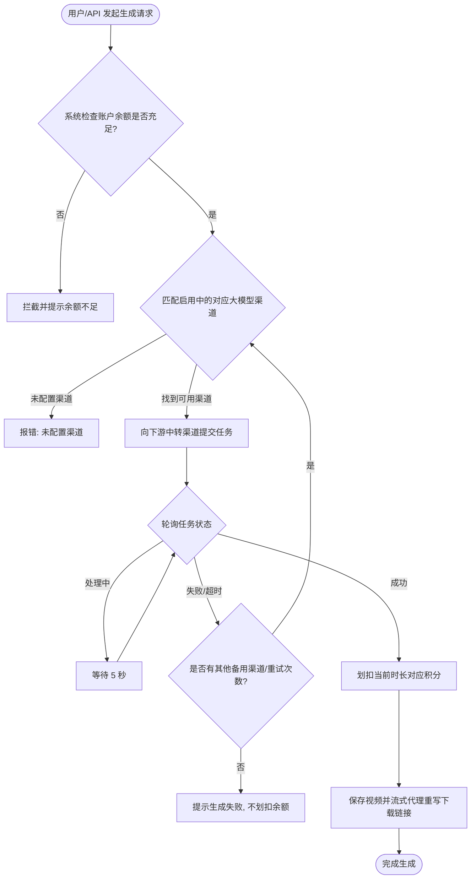

# 运维与渠道配置指南 (Operational Guide)

本指南旨在指导管理员和运维人员如何配置外部 API 渠道、管理大模型属性、自定义销售价格以及进行多渠道扩容管理。

---

## 📊 0. 核心配置与转发流程图

为了方便快速理解，以下展示了系统的核心操作与请求流转逻辑：

### 流程一：添加与配置新中转站的完整链路


### 流程二：用户请求路由、计费与自动容灾重试机制


---

## 📡 1. 配置上游 API Key (以接入 XS-Token 为例)

当系统需要调用第三方平台（如 [XS-Token](https://api.xs-token.com)）的模型时，需要为系统配置正确的访问凭证。

### 方式一：管理后台可视化配置 (推荐)
1. 登录系统，点击左下角的 **「管理后台」**。
2. 在左侧菜单中选择 **「📡 渠道管理」** (http://localhost:3000/admin/channels)。
3. 点击 **「添加渠道」**，配置如下参数：
   * **渠道名称**：`XS-Token 中转渠道`
   * **渠道类型**：`openai`
   * **Base URL**：`https://api.xs-token.com` （*注意：末尾不要加 `/v1`，后端在路由转发时会自动追加*）
   * **API Key**：填入您在外部平台申请的真实密钥（形如 `sk-xxxxxxxxxxxxxxxxxxxxxxxx`）
   * **支持模型 (Supported Models)**：按行填入需要通过此中转站派发的模型标识（如 `sora-v4-fast`）
4. 点击 **「保存」**。
5. 在列表中找到该渠道，点击右侧的 **「测试」**。若提示 `✅ 测试成功`，说明配置就绪。

### 方式二：环境变量后备配置
如果数据库中未配置针对特定模型的专用渠道，系统会回退使用环境变量配置：
1. 打开项目根目录下的 [.env](file:///d:/2026-07-04_0129/--main/.env) 文件。
2. 修改或添加以下两项配置：
   ```ini
   GROK2API_BASE_URL=https://api.xs-token.com
   GROK2API_API_KEY=sk-你的真实APIKey
   ```
3. 保存并重启后台服务以使环境变量生效。

---

## 🤖 2. 修改模型展示名称

系统支持动态修改前端页面和开发者中心展示给用户的模型名称：

1. 登录超级管理员账号，进入 **「管理后台」**。
2. 选择 **「🤖 大模型管理」** (http://localhost:3000/admin/models)。
3. 在模型列表中找到要编辑的模型（如 ID 为 `sora-v4-fast` 的行），点击右侧 of **「编辑」**。
4. 修改 **「显示名称」**（如改为 `Sora 快速生成` 或 `Sora-V4 (快速超清)`）。
5. 点击 **「保存」**，刷新前端视频生成页面即可即时看到更改。

> [!NOTE]
> 如果您希望出厂时就将默认名字写死，也可以直接在代码中修改 [video.ts:DEFAULT_VIDEO_MODELS](file:///d:/2026-07-04_0129/--main/server/routes/video.ts) 的 `name` 属性。

---

## 💰 3. 自定义销售价格 (二次加价)

为了向您的用户（包括网页端用户与通过 API 调用的企业客户）进行二次加价扣费，价格修改已被绑定到了数据库系统设置中。

### 网页端 & API 统一秒级价格修改
1. 登录超级管理员账号，进入 **「管理后台」**。
2. 选择 **「⚙️ 系统设置」**（或设置管理）。
3. 找到项目：`Sora V4 720p费率(¥/秒)`。
4. 点击编辑，将其值由默认的 `1.50` 修改为您的理想零售价（如 `2.00` 或 `3.00` 积分/秒）。
5. 点击 **「保存」**。保存后，网页版生成以及 API 外部调用将同时按照新价格进行余额预估和划扣。

### 针对特定 Token 的个性化计费 (API 计费规则)
如果您希望对某些普通用户或 API 渠道设置不同的按次或按 Token 计费规则：
1. 进入 **「管理后台 -> 💰 计费设置 / 计费管理」**。
2. 点击 **「添加规则」**，输入匹配的 **「模型匹配模式」**（如 `sora-v4-fast`）。
3. 选择计费类型（如 `按次计费`）并配置单次扣除金额，点击保存。

---

## 📡 4. 接入其他第三方中转站 (分流与备用)

当您未来需要引入其他的中转站以实现降本增效、负载均衡或高可用时，可按以下流程配置：

```mermaid
graph TD
    A[发起视频生成请求] --> B{查找可用渠道}
    B -- 匹配模型ID --> C[中转渠道 A (权重 10)]
    B -- 匹配模型ID --> D[中转渠道 B (权重 5)]
    C -- 请求失败/超时 --> E[自动重试并切换]
    E --> D
    D --> F[返回结果]
    C -- 请求成功 --> F
```

### 步骤 A：新建渠道
1. 进入 **「管理后台 -> 📡 渠道管理」**，点击 **「添加渠道」**。
2. 配置新中转站的 `Base URL`、`API Key`。
3. 在 **「支持模型 (Supported Models)」** 中填入您要分发给此中转站的模型（如 `sora-v4-fast`）。
4. **使用名称映射（非常实用）**：
   * 如果该中转站上模型的名字与您的系统名字不一致（例如，对方的名字叫 `sora-v4-fast-custom`，但您的系统对外暴露的叫 `sora-v4-fast`），可在渠道的 **「模型映射 (Model Mapping)」** 中填入：
     `sora-v4-fast:sora-v4-fast-custom`
   * 系统在转发请求给该渠道时，会自动将模型名进行重写替换。
5. 设置该渠道的 **「权重 (Weight)」**。系统会自动根据权重进行负载分流；如果权重高的渠道请求失败，系统会自动无缝重试权重较低的备用渠道。

### 步骤 B：添加新大模型 (如有需要)
如果新中转站引入了之前系统**未曾支持**的全新模型：
1. 进入 **「管理后台 -> 🤖 大模型管理」**，点击 **「添加模型」**。
2. 登记其 `模型ID`、`显示名称`，勾选其支持的能力属性（如 `video`）。
3. 进入 **「管理后台 -> 💰 计费设置」**，为新模型添加费率扣费标准，使其对客户生效。
